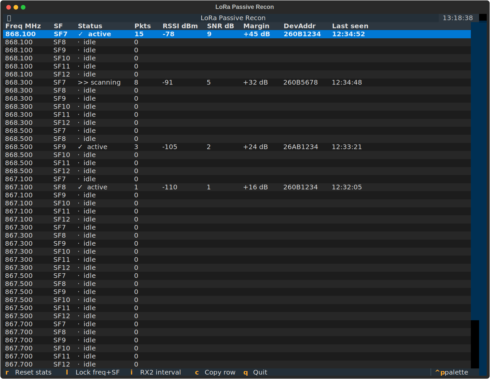
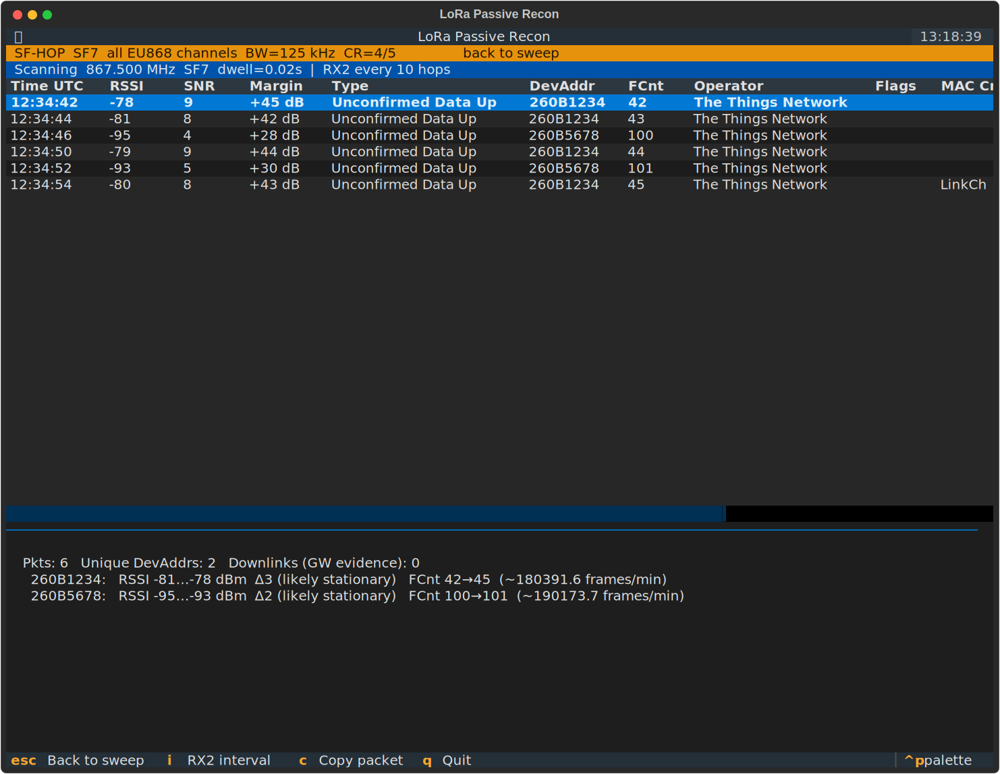
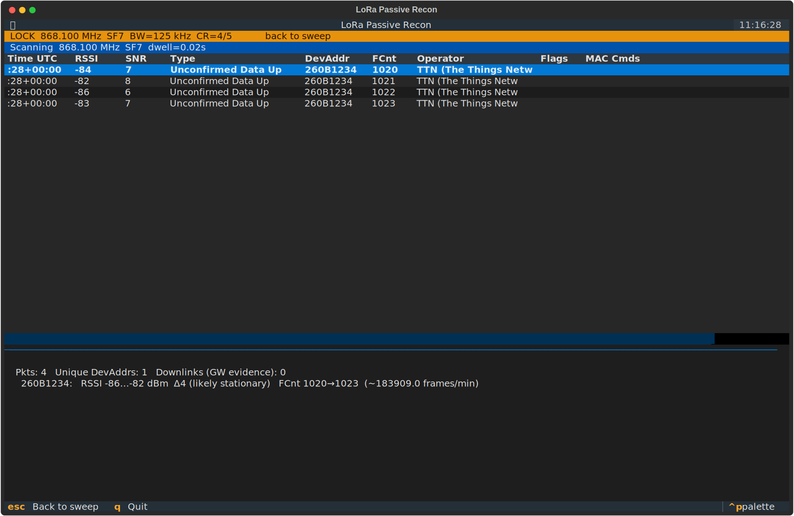
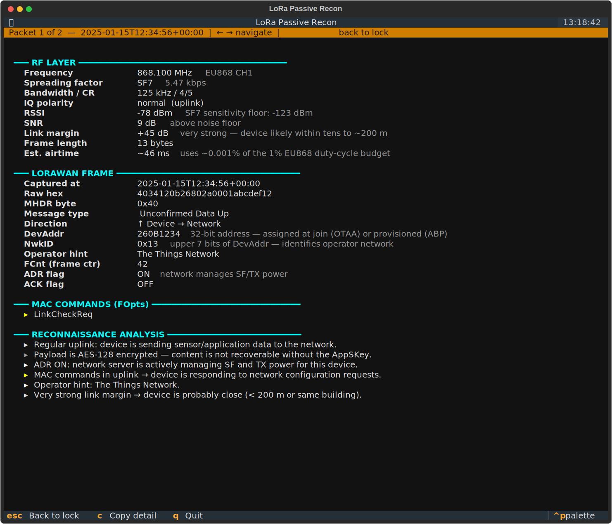

# LoRa Passive Reconnaissance

Passive two-phase scanner for EU868 LoRa / LoRaWAN traffic using an M5Stack Unit LoRaWAN-EU868 (RAK3172 / STM32WLE5) connected over USB. No transmission, no association — listen only. Completely made by AI.

Two interfaces are provided:
- **`lora_recon.py`** — headless CLI, logs packets to console / JSON / CSV
- **`lora_tui.py`** — interactive Textual TUI with a live sweep table and per-combo packet monitor

## Hardware

- M5Stack Unit LoRaWAN-EU868 (RAK3172 module, firmware RUI3 ≥ 1.0.4)
- USB-RS232 adapter connecting the unit's UART to your host
- EU868 antenna

The module is auto-detected by scanning for known USB-serial VID/PIDs. Pass `--port` explicitly if auto-detection misses it.

### Serial port permissions (Linux)

```bash
sudo usermod -aG dialout $USER
# log out and back in, or: newgrp dialout
```

## Installation

```bash
git clone https://github.com/igorolhovskiy/lora-recon-m5-eu868.git
cd lora-recon-m5-eu868
python -m venv .pyproject
source .pyproject/bin/activate
pip install pyserial rich textual pytest pytest-asyncio
```

## CLI usage — `lora_recon.py`

```
python lora_recon.py [options]
```

| Option | Default | Description |
|---|---|---|
| `--port` | auto | Serial port (`/dev/ttyUSB0`, etc.) |
| `--baudrate` | 115200 | UART baud rate |
| `--sweep-only` | off | Phase 1 only — never enter lock mode |
| `--lock-freq HZ` | — | Skip sweep, lock directly on this frequency |
| `--lock-sf SF` | 7 | Spreading factor for direct lock (7–12) |
| `--lock-duration MIN` | 10.0 | How long to stay in lock mode (minutes) |
| `--freq-hop` | off | Lock mode: hop all 8 EU868 channels at the fixed SF instead of staying on one frequency |
| `--rx2-interval N` | 10 | Check RX2 downlink channel every N hops |
| `--output BASENAME` | — | Save results to `BASENAME.json` + `BASENAME.csv` |
| `--dedup-window SEC` | 30.0 | Suppress duplicate `(DevAddr, FCnt)` within this window |
| `--verbose` | off | Debug-level logging |
| `--no-rich` | off | Plain text output (useful for piping) |

### Examples

```bash
# Auto-detect port, full sweep then lock
python lora_recon.py

# Save to files
python lora_recon.py --output recon_$(date +%F)

# Sweep only, no lock phase
python lora_recon.py --sweep-only

# Jump straight to a known active combo, hopping all channels at SF7
python lora_recon.py --lock-freq 868100000 --lock-sf 7 --freq-hop --lock-duration 30
```

### Two-phase operation

**Phase 1 — Sweep**: Cycles all 48 EU868 channel × SF combinations (8 channels × SF 7–12). Every N hops it briefly parks on the RX2 downlink channel (869.525 MHz / SF12, IQ-inverted) to detect gateway traffic. Any combo that receives a packet is flagged active and queued for Phase 2. The TUI sweep behaves identically — the RX2 row at the bottom of the sweep table lights up when a downlink is received.

**Phase 2 — Lock**: Two modes are available:

| Mode | Flag | Behaviour |
|---|---|---|
| SF-hop (recommended) | `--freq-hop` | Fixes SF, cycles all 8 EU868 channels each pass |
| Single lock | *(default)* | Fixes both frequency and SF |

SF-hop is the better choice for tracking devices because LoRaWAN mandates pseudo-random channel hopping on every transmission. A device transmitting on 868.1 MHz for one packet will use a different channel for the next. Fixing both dimensions means you only catch ~1/8 of a device's packets. SF-hop follows the device across channels and captures ~8× more traffic for the same monitoring time.

### Dwell times

| SF | Dwell | Approx max packet airtime |
|---|---|---|
| SF7 | 2 s | ~0.05–0.13 s |
| SF8 | 3 s | ~0.10–0.25 s |
| SF9 | 5 s | ~0.19–0.50 s |
| SF10 | 8 s | ~0.37–1.0 s |
| SF11 | 12 s | ~0.75–2.0 s |
| SF12 | 20 s | ~1.5–4.0 s |

One full sweep pass takes approximately **400 s (≈ 6.7 min)**. If you already know which combo is active, skip the sweep with `--lock-freq` + `--lock-sf` + `--freq-hop`.

---

## TUI usage — `lora_tui.py`

```bash
python lora_tui.py [--port /dev/ttyUSB0] [--baudrate 115200]
```

### Sweep screen

Launches immediately. Shows a 49-row table: 48 EU868 uplink combinations (8 channels × SF7–SF12) plus a dedicated **869.525 MHz / SF12 (RX2)** row at the bottom.



| Column | Meaning |
|---|---|
| Freq MHz | Channel frequency |
| SF | Spreading factor (SF7–SF12) |
| Status | `>> scanning` / `✓  active` / `·  idle` / `·  RX2` |
| Pkts | Packets received on this combo |
| RSSI dBm | Signal strength of most recent packet |
| SNR dB | Signal-to-noise ratio |
| Margin | Link margin — RSSI minus the SF sensitivity floor (see [Link margin](#link-margin)) |
| DevAddr | Device address (or JoinEUI for join requests) |
| Last seen | Timestamp of most recent packet |

The sweep checks the RX2 channel (IQINVER=1, correct polarity for downlinks) every N hops, where N is the RX2 interval. Gateway downlinks appear in the RX2 row. Press `I` to cycle the interval.

**Controls:**

| Key | Action |
|---|---|
| ↑ / ↓ | Navigate rows |
| Enter | **SF-hop lock** — fix SF from selected row, hop all 8 EU868 channels |
| L | **Single lock** — fix both frequency and SF from selected row |
| I | Cycle RX2 check interval (1 / 2 / 5 / 10 / 20 hops) |
| R | Reset all statistics |
| C | Copy selected row to clipboard |
| Q | Quit |

### Lock screen — SF-hop mode (Enter)

Fixes the spreading factor and cycles all 8 EU868 uplink channels, following the mandatory channel hopping that LoRaWAN devices use. The status bar shows the channel currently being scanned and its dwell time. RX2 interleave checks appear as "RX2 check".



### Lock screen — single frequency mode (L)

Fixes both the frequency and SF. Useful when you want to deep-monitor a specific known combination (e.g. 868.1 MHz / SF7 from a static sensor). Captures fewer packets from channel-hopping devices but gives the cleanest view of a single channel.



**Lock screen columns:**

| Column | Meaning |
|---|---|
| Time UTC | Packet receive time |
| RSSI | Signal strength (dBm) |
| SNR | Signal-to-noise ratio (dB) |
| Margin | Link margin in dB — see [Link margin](#link-margin) |
| Type | LoRaWAN message type |
| DevAddr | Device address (or JoinEUI) |
| FCnt | Frame counter — gaps indicate missed packets |
| Operator | Best-effort network operator from NwkID |
| Flags | `DL` for downlinks received on RX2 |
| MAC Cmds | Decoded MAC commands from FOpts (see below) |

**Lock screen controls:**

| Key | Action |
|---|---|
| Enter | Open full packet detail for the selected row |
| I | Cycle RX2 check interval (1 / 2 / 5 / 10 / 20 hops) |
| C | Copy selected packet detail to clipboard |
| Esc | Return to sweep screen |
| Q | Quit |

### Packet detail screen

Press **Enter** on any row in the lock view to open the full packet decode and reconnaissance analysis for that packet.



The detail screen shows four sections:

- **RF LAYER** — frequency, SF, bandwidth, IQ polarity, RSSI, SNR, link margin, frame length, and estimated airtime with EU868 duty-cycle impact.
- **LORAWAN FRAME** — timestamp, raw hex, MHDR message type, direction, DevAddr / NwkID / operator / FCnt / ADR+ACK flags (data frames), or JoinEUI / DevEUI / OUI (join requests).
- **MAC COMMANDS (FOpts)** — decoded MAC command list, shown only when FOpts are present.
- **RECONNAISSANCE ANALYSIS** — plain-English interpretation: what the frame type reveals, signal strength assessment, device proximity estimate, and ADR / ACK / FCnt observations.

**Packet detail controls:**

| Key | Action |
|---|---|
| ← / → | Navigate to the previous / next captured packet |
| C | Copy full packet detail to clipboard |
| Esc | Return to lock screen |
| Q | Quit |

---

## Understanding the output

### Packet fields

| Field | Notes |
|---|---|
| `rssi` | Received signal strength in dBm. −80 or better = strong nearby device |
| `snr` | Signal-to-noise ratio. Positive = good link budget |
| `mtype` | LoRaWAN message type from MHDR (Unconfirmed Data Up, Join Request, …) |
| `dev_addr` | 4-byte DevAddr in hex (data frames); absent on join requests |
| `nwk_id` | Upper 7 bits of DevAddr — identifies the network operator |
| `operator` | Best-effort operator guess from NwkID |
| `fcnt` | Frame counter (uplinks only) — monotonically increasing; gaps mean missed packets |
| `is_downlink` | `true` for packets on RX2 (gateway → device direction) |
| `mac_commands` | Decoded MAC commands from FOpts (LoRaWAN 1.0.x only — unencrypted) |

### Operator identification from NwkID

| NwkID | Operator |
|---|---|
| 0x00 | Private / ChirpStack |
| 0x13 (19) | The Things Network |
| 0x24 (36) | Actility / ThingPark |

Other values indicate other commercial or private networks.

### MAC commands (FOpts)

In LoRaWAN 1.0.x networks, MAC commands piggybacked in the frame header (`FOpts`) are transmitted in plaintext. The tool decodes all standard commands in both uplink and downlink directions:

| Command | Direction | What it reveals |
|---|---|---|
| `LinkCheckReq` | UL | Device is requesting link quality info from network |
| `LinkCheckAns` | DL | Network's SNR margin and gateway count seen by the device |
| `LinkADRReq` | DL | Network commanding a new SF, TX power, and channel mask — reveals the RF management strategy |
| `LinkADRAns` | UL | Device's acceptance/rejection of each ADR parameter |
| `DutyCycleReq` | DL | Network imposing a duty-cycle limit on the device |
| `RXParamSetupReq` | DL | Network reconfiguring RX1 offset and RX2 parameters |
| `DevStatusReq` | DL | Network polling battery level and link margin |
| `DevStatusAns` | UL | Battery level (%) and SNR margin of last downlink |
| `NewChannelReq` | DL | Network adding or modifying a channel — exposes the full channel plan |
| `RXTimingSetupReq` | DL | Network adjusting RX1 window delay |
| `TxParamSetupReq` | DL | Network setting max EIRP and dwell-time limits |
| `DlChannelReq` | DL | Network assigning a separate downlink frequency to a channel |
| `DeviceTimeReq` | UL | Device requesting GPS-synchronized time |
| `DeviceTimeAns` | DL | Network providing GPS-synchronized time |

> **Note:** LoRaWAN 1.1 networks encrypt FOpts. On those networks the `MAC Cmds` column will show garbage bytes rather than meaningful commands.

### Link margin

The **Margin** column shows how many dB above the receiver's sensitivity floor the packet arrived:

```
Margin = RSSI − sensitivity_floor(SF)
```

Sensitivity floors (SX1262, BW=125 kHz, CR=4/5):

| SF | Floor |
|---|---|
| SF7 | −123 dBm |
| SF8 | −126 dBm |
| SF9 | −129 dBm |
| SF10 | −132 dBm |
| SF11 | −135 dBm |
| SF12 | −137 dBm |

A margin of +40 dB or more suggests a nearby or high-power device. A margin of +5 dB means the link is at the edge of coverage.

**Why not distance?** Converting RSSI to distance requires knowing the device's transmit power (0–14 dBm, set by ADR — unreadable without decrypting the session), the path loss exponent (2–6 depending on environment), and antenna gains. These are all unknown in a passive recon context. The same RSSI value can represent 100 m in open terrain or 5 km in dense urban cover. Margin is honest; a distance figure would not be.

### RX2 downlink activity

A packet captured on 869.525 MHz / SF12 is a confirmed downlink from a LoRaWAN gateway. Seeing downlinks means a gateway is within RF range even if you have not yet caught any uplinks.

The RX2 channel requires **inverted IQ polarity** (IQINVER=1). Both the sweep loop and the lock monitor set this automatically before opening the RX2 window and restore it afterward. Locking directly on 869.525 MHz via `--lock-freq` leaves IQ in uplink mode (IQINVER=0) and will not capture downlinks — use `--rx2-interval 1` with any short-dwell uplink channel instead.

### ETSI EN 300.220 frequency compliance

All channels used by this tool fall within the sub-bands defined in ETSI EN 300.220 section 7.2.3:

| Channels | Sub-band | Range | Max ERP | Duty cycle |
|---|---|---|---|---|
| 868.1, 868.3, 868.5 MHz | M | 868.0–868.6 MHz | 25 mW | 1% |
| 867.1–867.9 MHz | L | 865.0–868.0 MHz | 25 mW | 1% |
| 869.525 MHz (RX2) | P | 869.4–869.65 MHz | 500 mW | 10% |

This tool is a **passive receiver only** — transmit-side duty cycle limits do not apply.

---

## Running tests

```bash
source .pyproject/bin/activate
pytest                        # all tests (no hardware required)
pytest test_lora_recon.py -v  # headless logic only (fast)
pytest test_lora_tui.py -v    # TUI tests (headless Textual pilot)
pytest -k TestLockMonitor     # single class
```

All tests mock the serial port — no hardware required.

## File overview

| File | Purpose |
|---|---|
| `lora_recon.py` | Core logic: AT driver, frame parser, FOpts decoder, sweep/lock engines, CLI |
| `lora_tui.py` | Textual TUI wrapping `lora_recon` |
| `test_lora_recon.py` | Unit tests for core logic |
| `test_lora_tui.py` | Unit + integration tests for TUI |
| `screenshots/` | SVG screenshots used in this README |
| `pytest.ini` | `asyncio_mode = auto` for pytest-asyncio |
| `CLAUDE.md` | Developer notes for Claude Code |
